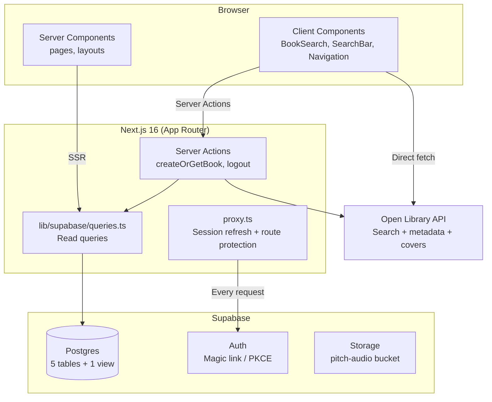

# Book Pitches — Architecture

> **Updated:** 2026-02-17
> **Method:** /snapshot full scan

---

## 1. Purpose

Voice-first platform where readers record ~90-second audio pitches for books they love. Browse curated books, discover pitches by category, and build a reading community through authentic voice recommendations. Built for book enthusiasts who want to share and discover reads beyond star ratings.

## 2. Architecture

### System Overview



### Tech Stack

| Layer | Technology | Version |
|-------|-----------|---------|
| Framework | Next.js (App Router, webpack mode) | 16.1.6 |
| Language | TypeScript | 5 |
| UI | React | 19.2.3 |
| Styling | Tailwind CSS (via @tailwindcss/postcss) | 4 |
| Database | Supabase (Postgres + Auth + Storage) | supabase-js 2.95.3 |
| Auth | Supabase Auth (magic link, PKCE) | @supabase/ssr 0.8.0 |
| Linting | ESLint | 9 |
| Fonts | Geist Sans + Geist Mono | next/font |

### Directory Structure

```
src/
├── app/                    # Next.js App Router pages
│   ├── (auth)/             #   Auth route group (login, check-email)
│   ├── auth/callback/      #   OAuth/magic-link callback handler
│   ├── actions/            #   Server Actions (books.ts, auth.ts)
│   ├── books/              #   /books and /books/[slug]
│   ├── categories/         #   /categories and /categories/[slug]
│   ├── users/              #   /users/[slug]
│   ├── layout.tsx          #   Root layout (Navigation + footer)
│   ├── page.tsx            #   Home page
│   └── globals.css         #   Global styles
├── components/             # Shared React components (9 files)
├── lib/                    # Utilities and data layer
│   ├── supabase/           #   Server/client clients, queries, types
│   ├── openlibrary.ts      #   Open Library API client
│   └── utils.ts            #   Slugify, formatting helpers
└── proxy.ts                # Auth middleware (Next.js 16 convention)

features/                   # Feature specs (PRD + tasks per feature)
├── ROADMAP.md              #   Prioritized feature list
├── pitch-creation-flow/    #   (ready for /prd)
├── audio-recorder/
├── discovery-page/
├── landing-page/
├── profile-page/
└── project-dashboard/

openspec/                   # Legacy OpenSpec artifacts (proposals + designs)
```

## 3. Data Model

```sql
-- 5 tables + 1 view, all with RLS enabled

CREATE TABLE books (
  id          UUID PRIMARY KEY DEFAULT gen_random_uuid(),
  title       TEXT NOT NULL,
  author      TEXT NOT NULL,
  open_library_key TEXT UNIQUE,
  cover_url   TEXT,
  published_year INTEGER,
  description TEXT,
  slug        TEXT NOT NULL UNIQUE,
  created_at  TIMESTAMPTZ DEFAULT now()
);

CREATE TABLE users (
  id          UUID PRIMARY KEY DEFAULT gen_random_uuid(),
  name        TEXT NOT NULL,
  slug        TEXT NOT NULL UNIQUE,
  avatar_url  TEXT,
  bio         TEXT,
  location    TEXT,
  created_at  TIMESTAMPTZ DEFAULT now()
);

CREATE TABLE pitches (
  id               UUID PRIMARY KEY DEFAULT gen_random_uuid(),
  user_id          UUID NOT NULL REFERENCES users(id),
  book_id          UUID NOT NULL REFERENCES books(id),
  audio_url        TEXT,
  rating           INTEGER CHECK (rating >= 0 AND rating <= 10),
  duration_seconds INTEGER,
  pitch_text       TEXT,
  created_at       TIMESTAMPTZ DEFAULT now()
);

CREATE TABLE categories (
  id            UUID PRIMARY KEY DEFAULT gen_random_uuid(),
  name          TEXT NOT NULL UNIQUE,
  slug          TEXT NOT NULL UNIQUE,
  display_order INTEGER DEFAULT 0
);

CREATE TABLE book_categories (
  book_id     UUID REFERENCES books(id),
  category_id UUID REFERENCES categories(id),
  PRIMARY KEY (book_id, category_id)
);

-- View: aggregated book stats
CREATE VIEW book_with_stats AS
  SELECT b.*, avg(p.rating) AS avg_rating, count(p.id) AS pitch_count
  FROM books b LEFT JOIN pitches p ON b.id = p.book_id
  GROUP BY b.id;
```

**Storage:** `pitch-audio` bucket (public, for audio file uploads)

**Migrations applied:**
1. `20260213074541` — voice_first_schema (initial)
2. `20260216051710` — allow_public_book_creation

## 4. Routes & Components

### Pages/Routes

| Route | File | Purpose |
|-------|------|---------|
| `/` | `app/page.tsx` | Home — hero, top 8 books, categories, search |
| `/books` | `app/books/page.tsx` | Browse all books, search via `?q=` |
| `/books/[slug]` | `app/books/[slug]/page.tsx` | Book detail — cover, metadata, categories, pitches |
| `/categories` | `app/categories/page.tsx` | All categories with book counts |
| `/categories/[slug]` | `app/categories/[slug]/page.tsx` | Category detail — books in category |
| `/users/[slug]` | `app/users/[slug]/page.tsx` | User profile — info, avg rating, pitches |
| `/login` | `app/(auth)/login/page.tsx` | Magic link login (redirects if authenticated) |
| `/login/check-email` | `app/(auth)/login/check-email/page.tsx` | Post-login email confirmation |
| `/auth/callback` | `app/auth/callback/route.ts` | PKCE callback — exchanges code for session |

### Server Actions

| Action | File | Purpose |
|--------|------|---------|
| `createOrGetBook()` | `app/actions/books.ts` | Dedup by open_library_key, fetch description, insert |
| `logout()` | `app/actions/auth.ts` | Sign out, revalidate, redirect |

### Core Components

| Component | File | Type | Purpose |
|-----------|------|------|---------|
| BookSearch | `components/BookSearch.tsx` | Client | Open Library search, 300ms debounce, calls createOrGetBook |
| Navigation | `components/Navigation.tsx` | Client | Sticky header, auth-aware (login/logout) |
| SearchBar | `components/SearchBar.tsx` | Client | Debounced search, updates URL params |
| BookCard | `components/BookCard.tsx` | Server | Book card with cover, title, author, rating |
| BookGrid | `components/BookGrid.tsx` | Server | Responsive 1-4 column grid of BookCards |
| ReviewCard | `components/ReviewCard.tsx` | Server | Pitch display — user, rating, text, date |
| CategoryCard | `components/CategoryCard.tsx` | Server | Category name + book count |
| Rating | `components/Rating.tsx` | Server | Numeric rating badge with color coding |
| TagBadge | `components/TagBadge.tsx` | Server | Small category badge, optionally linked |

### Library Modules

| Module | File | Purpose |
|--------|------|---------|
| Server client | `lib/supabase/server.ts` | Cookie-based Supabase client for SSR |
| Browser client | `lib/supabase/client.ts` | Browser Supabase client |
| Queries | `lib/supabase/queries.ts` | getBooks, getBookBySlug, getCategories, searchBooks, etc. |
| Types | `lib/supabase/types.ts` | Generated DB types + convenience aliases |
| Open Library | `lib/openlibrary.ts` | searchBooks, fetchBookDescription, getBookCoverUrl |
| Utils | `lib/utils.ts` | slugify, formatRating, getBookCoverUrl, truncateText |

## 5. External Dependencies

### Services

| Service | Purpose | Auth Method |
|---------|---------|-------------|
| Supabase | Database, Auth, Storage | Anon key (public) + service role key (server) |
| Open Library API | Book search + metadata | None (public API) |

### Environment Variables

| Variable | Required | Purpose |
|----------|----------|---------|
| `NEXT_PUBLIC_SUPABASE_URL` | Yes | Supabase project URL |
| `NEXT_PUBLIC_SUPABASE_ANON_KEY` | Yes | Supabase publishable key |
| `SUPABASE_SERVICE_ROLE_KEY` | Yes | Server-side admin access |

## 6. Feature Status

| Feature | Status | Directory |
|---------|--------|-----------|
| Open Library Search | done | (integrated in components/) |
| Magic Link Auth | done | (needs email template config) |
| Database Schema | done | (5 tables, RLS, storage) |
| Pitch Creation Flow | ready | `features/pitch-creation-flow/` |
| Audio Recorder | ready | `features/audio-recorder/` |
| Discovery Page | ready | `features/discovery-page/` |
| Landing Page | ready | `features/landing-page/` |
| Profile Page | ready | `features/profile-page/` |
| Project Dashboard | ready | `features/project-dashboard/` |

## 7. Known Gaps

| Gap | Severity | Location |
|-----|----------|----------|
| RLS INSERT policies lack auth checks | Medium | Supabase policies |
| Magic link email template not configured | Low | Supabase dashboard |
| Protected routes `/record`, `/settings` not implemented | Low | proxy.ts references them |
| No test files or test framework | Medium | Project-wide |
| No CI/CD pipeline | Low | No .github/workflows/ |
| No .env.example for local setup docs | Low | Project root |
| BookSearch component not mounted in any page | Medium | components/BookSearch.tsx |
| All pages use `force-dynamic` rendering | Low | All page.tsx files |

## 8. Decision Log

| Date | Decision | Rationale |
|------|----------|-----------|
| 2026-02-13 | Webpack over Turbopack | Turbopack crashes on this project |
| 2026-02-13 | Supabase MCP for migrations | No local Supabase CLI needed |
| 2026-02-16 | proxy.ts over middleware.ts | Next.js 16 naming convention |
| 2026-02-16 | Open Library key for dedup | Prevents duplicate book entries from search |
| 2026-02-17 | PRD system over OpenSpec | Simpler, better for autonomous Ralph loops |
| 2026-02-17 | Text-only pitches first | Audio recorder is feature #2, text fallback for V1 |
