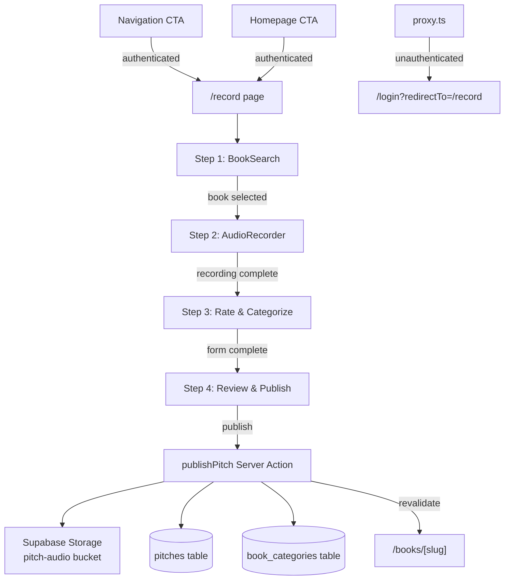

# Pitch Creation Flow — PRD

> **Feature:** pitch-creation-flow
> **Status:** draft
> **Generated:** 2026-02-17
> **Project:** Book Pitches (Next.js 16 / Supabase / Tailwind 4)

---

## 1. Problem

There is no way for users to create content on the platform. The BookSearch component exists but isn't mounted anywhere, and the pitches table has zero rows. Without a creation flow, the app is read-only with nothing to read.

## 2. Solution

A single-page multi-step flow at `/record` where authenticated users search for a book, record an audio pitch (via MediaRecorder API), rate the book, select categories, and publish. This merges the originally separate "audio recorder" feature into the creation flow since audio is required from day 1.

## 3. Capabilities

| Capability | Type | Description |
|------------|------|-------------|
| Record page | page | `/record` — multi-step form (search → record → rate → categorize → publish) |
| useAudioRecorder | hook | MediaRecorder state machine (idle → recording → paused → stopped) with blob capture |
| AudioRecorder | component | Record/pause/stop controls, timer, playback preview |
| CategoryPills | component | Multi-select pill buttons for 1-3 category selection |
| RatingSlider | component | Integer 0-10 slider with prominent value display |
| BookSummary | component | Collapsed display of selected book (cover, title, author) |
| PitchReview | component | Pre-publish summary with audio playback, rating, categories |
| publishPitch | server-action | Upload audio to Storage, upsert pitch record, insert book_categories, revalidate |
| Nav CTA | modification | "Record a Pitch" link in Navigation for authenticated users |
| Homepage CTA | modification | "Record a Pitch" button in hero section for authenticated users |

## 4. Scope

**In scope:**
- Single-page multi-step flow with client-side state (no URL-based wizard)
- Audio recording via native MediaRecorder API (WebM/MP4 depending on browser)
- 3-minute max recording with countdown timer
- Microphone permission request with error handling
- Pause/resume and re-record
- Audio preview (playback before publishing)
- Rating slider (integer 0-10)
- Category multi-select pills (1-3 from existing 10 categories)
- Server Action for atomic publish (audio upload + pitch upsert + categories)
- Edit/re-record for existing pitches (UNIQUE constraint: user_id + book_id)
- Auth redirect for unauthenticated users (proxy.ts already handles `/record`)
- beforeunload warning when recording exists
- Nav + homepage CTA (logged-in users only)

**Out of scope:**
- Waveform visualization (V2)
- Draft saving / IndexedDB persistence (V2)
- Text-only pitches (audio is required)
- Scheduled or delayed publishing
- Collaborative pitches
- Bulk recording
- Audio transcription
- Audio editing/trimming

## 5. Technical Design

### Architecture



### Key Decisions

| Decision | Choice | Why | Alternative Considered |
|----------|--------|-----|----------------------|
| Flow structure | Single page, collapsing steps | Preserves state in React; no persistence needed | Multi-route wizard (requires URL state) |
| Audio API | Native MediaRecorder | No dependencies, good browser support | Third-party libs (unnecessary complexity) |
| Audio format | Browser-native (WebM/MP4) | No transcoding needed; Storage accepts both | Force single format (breaks Safari) |
| Publish mechanism | Server Action | Idiomatic Next.js App Router; handles revalidation | API route (requires manual FormData handling) |
| Rating scale | Integer 0-10 | Matches existing schema CHECK constraint | 0.5 increments (requires schema migration) |
| Duplicate handling | Upsert on UNIQUE(user_id, book_id) | One pitch per user per book; re-recording overwrites | Block duplicates (worse UX) |
| Category UI | Clickable pills | All 10 fit on screen; touch-friendly | Dropdown (worse for small set) |
| Category handling | Union/additive (insert new, keep existing) | Allows multiple users to contribute categories to a book | Delete+replace (loses other users' categories) |
| Storage path | `{user_id}/{book_id}.{ext}` | Clean, unique, overwrite-safe | Timestamped paths (creates orphans) |

### Data Model

No schema migrations needed. Existing tables support the full flow:

- **pitches**: `user_id`, `book_id`, `audio_url`, `rating`, `duration_seconds`, `pitch_text` (optional), `created_at`
- **book_categories**: `book_id`, `category_id` (composite PK)
- **Constraints**: `UNIQUE(user_id, book_id)`, `CHECK(rating >= 0 AND rating <= 10)`, FK cascades

Storage bucket `pitch-audio` exists (public, 10MB limit, audio MIME types).

### Key Interfaces

```typescript
// useAudioRecorder hook
type RecorderState = 'idle' | 'recording' | 'paused' | 'stopped'

interface AudioRecorderReturn {
  state: RecorderState
  duration: number           // seconds elapsed
  audioBlob: Blob | null     // recorded audio
  audioUrl: string | null    // object URL for preview playback
  error: string | null
  startRecording: () => Promise<void>
  pauseRecording: () => void
  resumeRecording: () => void
  stopRecording: () => void
  resetRecording: () => void
}

// publishPitch Server Action
interface PublishPitchInput {
  bookId: string
  rating: number             // integer 0-10
  categoryIds: string[]      // 1-3 category UUIDs
  audioBlob: Blob
  audioDuration: number      // seconds
  pitchText?: string         // optional text companion
}

interface PublishPitchResult {
  data: { bookSlug: string } | null
  error: string | null
}

// Step state managed by parent RecordPage
interface PitchFormState {
  step: 'search' | 'record' | 'rate' | 'review'
  selectedBook: Book | null
  audioBlob: Blob | null
  audioDuration: number
  rating: number
  selectedCategoryIds: string[]
}
```

## 6. UX Flow

1. User clicks "Record a Pitch" in nav or homepage (only visible when logged in).
2. User arrives at `/record`. Step 1 (Search) is active. BookSearch component is displayed.
3. User types a book title/author. Results appear with 300ms debounce.
4. User clicks a book result. BookSearch collapses into a BookSummary showing cover, title, author. Step 2 (Record) activates.
   - If user already pitched this book: show notice "You've already pitched this book. Recording will replace your existing pitch." Pre-fill rating and categories from existing pitch.
5. User sees AudioRecorder with a prominent "Start Recording" button. Browser requests microphone permission.
   - If permission denied: show error message with instructions to enable in browser settings.
6. User clicks "Start Recording". Timer starts counting up. Max 3 minutes with countdown in final 30 seconds.
7. User can pause/resume. Timer pauses accordingly.
8. User clicks "Stop". Audio preview appears with playback controls.
   - User can "Re-record" (resets recorder) or "Continue" to next step.
9. Step 3 (Rate & Categorize) activates. User sees:
   - Rating slider (0-10, integer steps) with large value display
   - 10 category pills. User selects 1-3.
   - Validation: rating required, 1-3 categories required.
10. User clicks "Continue". Step 4 (Review) activates showing:
    - Book summary, audio playback, rating badge, category pills
    - "Publish" button and "Back" to edit
11. User clicks "Publish". Loading state on button. Server Action executes:
    - Uploads audio to `pitch-audio/{user_id}/{book_id}.webm`
    - Upserts pitch record
    - Inserts/replaces book_categories
    - Returns book slug
12. Success: redirect to `/books/{slug}` where the new pitch is visible.
13. Error: show error message, keep form state, allow retry.

**Edge cases:**
- Page refresh during recording: recording is lost. beforeunload warning fires if audioBlob exists.
- Audio upload fails: pitch record is NOT created. Error shown, user retries.
- Network offline: publish fails gracefully with error message.

## 7. Requirements

### REQ-01: Protected Route
The system SHALL require authentication to access `/record`.

**WHEN** an unauthenticated user navigates to `/record`
**THEN** they are redirected to `/login?redirectTo=/record`
**AND** after login they are redirected back to `/record`

### REQ-02: Book Search
The system SHALL display the BookSearch component as the first step.

**WHEN** an authenticated user lands on `/record`
**THEN** they see a search input for finding books by title or author
**AND** results appear after 300ms debounce with 3+ character input

### REQ-03: Book Selection
The system SHALL collapse the search into a summary after book selection.

**WHEN** the user clicks a search result
**THEN** the book is created/fetched via createOrGetBook server action
**AND** BookSearch collapses to show cover, title, author
**AND** the Audio Recording step activates

### REQ-04: Existing Pitch Detection
The system SHALL detect when the user already has a pitch for the selected book.

**WHEN** the user selects a book they've already pitched
**THEN** display a notice that re-recording will replace the existing pitch
**AND** pre-fill rating and categories from the existing pitch

### REQ-05: Microphone Permission
The system SHALL request microphone access before recording.

**WHEN** the user activates the recording step
**THEN** the browser's microphone permission dialog appears
**AND** if denied, an error message explains how to enable it

### REQ-06: Audio Recording
The system SHALL record audio via MediaRecorder API with a 10-second minimum and 3-minute maximum.

**WHEN** the user clicks "Start Recording"
**THEN** audio recording begins with a visible timer counting up
**AND** the stop button is disabled until 10 seconds have elapsed
**AND** recording auto-stops at 3 minutes
**AND** a countdown warning appears in the final 30 seconds

### REQ-07: Pause/Resume
The system SHALL allow pausing and resuming during recording.

**WHEN** the user clicks "Pause"
**THEN** recording pauses and the timer freezes
**AND** a "Resume" button replaces "Pause"

### REQ-08: Audio Preview
The system SHALL provide playback of the recorded audio before publishing.

**WHEN** recording stops (manually or at 3-minute limit)
**THEN** an audio player appears with play/pause controls
**AND** the user can choose "Re-record" or "Continue"

### REQ-09: Rating
The system SHALL collect an integer rating from 0 to 10.

**WHEN** the user reaches the Rate step
**THEN** a slider input is displayed (0-10, integer steps)
**AND** the current value is displayed prominently

### REQ-10: Category Selection
The system SHALL allow selecting 1 to 3 categories from the existing 10.

**WHEN** the user reaches the Categorize step
**THEN** all 10 categories appear as clickable pill buttons
**AND** the user must select between 1 and 3 categories to proceed
**AND** selected categories are added to the book's existing categories (union/additive)

### REQ-11: Pre-Publish Review
The system SHALL show a summary of the pitch before publishing.

**WHEN** the user completes rating and categorization
**THEN** a review screen shows: book info, audio player, rating, categories
**AND** "Publish" and "Back" buttons are available

### REQ-12: Atomic Publish
The system SHALL publish the pitch atomically (audio upload + DB record + categories).

**WHEN** the user clicks "Publish"
**THEN** audio is uploaded to `pitch-audio/{user_id}/{book_id}.{ext}`
**AND** a pitch record is upserted (INSERT or UPDATE on conflict)
**AND** book_categories are added (union) — new categories inserted via ON CONFLICT DO NOTHING
**AND** the book page and user profile are revalidated

### REQ-13: Success Redirect
The system SHALL redirect to the book page after successful publishing.

**WHEN** the pitch is published successfully
**THEN** the user is redirected to `/books/{slug}`
**AND** their new pitch is visible on the page

### REQ-14: Nav CTA
The system SHALL show a "Record a Pitch" link in the navigation for authenticated users.

**WHEN** a user is logged in
**THEN** a "Record a Pitch" link appears in the nav bar
**AND** it links to `/record`

### REQ-15: Unsaved Changes Warning
The system SHALL warn before navigating away with an unsaved recording.

**WHEN** the user has recorded audio but not published
**THEN** a beforeunload warning fires on page navigation/close

## 8. Risks

| Risk | Likelihood | Impact | Mitigation |
|------|-----------|--------|------------|
| Safari MediaRecorder quirks | Medium | Medium | Test with MP4 container; fallback mime type detection |
| Mobile Safari MediaRecorder issues | Medium | High | Test mime type detection, iOS audio session handling, touch-friendly controls |
| Audio blob lost on refresh | High | Medium | beforeunload warning; accept as V1 limitation |
| Large audio files (3min ≈ 3-5MB) | Low | Low | pitch-audio bucket has 10MB limit; WebM is compact |
| Publish fails after upload | Low | Medium | Orphaned audio gets overwritten on retry (same path) |
| User has no microphone | Low | High | Clear error message; no fallback in V1 |
| Slow upload on mobile | Medium | Medium | Loading state on publish button; disable re-click |

## 9. Success Criteria

- [ ] Authenticated user can navigate to `/record` and complete the full flow
- [ ] Unauthenticated user is redirected to login and back to `/record`
- [ ] Audio records correctly in Chrome, Firefox, and Safari
- [ ] Recording respects 3-minute max with countdown
- [ ] Pause/resume works correctly
- [ ] Audio preview plays back the recording
- [ ] Rating slider works (integer 0-10)
- [ ] Category pills enforce 1-3 selection
- [ ] Publish uploads audio and creates pitch record
- [ ] Existing pitch is detected and overwritten on re-record
- [ ] Book page shows the new pitch after publishing
- [ ] Nav CTA appears only for logged-in users
- [ ] beforeunload warning fires with unsaved recording

## 10. Impact

### New Files
| File | Purpose |
|------|---------|
| `src/hooks/useAudioRecorder.ts` | MediaRecorder state machine hook |
| `src/components/AudioRecorder.tsx` | Record/pause/stop UI with timer |
| `src/components/CategoryPills.tsx` | Multi-select category pill buttons |
| `src/components/RatingSlider.tsx` | 0-10 integer rating slider |
| `src/components/BookSummary.tsx` | Collapsed book display (cover + title + author) |
| `src/components/PitchReview.tsx` | Pre-publish summary with playback |
| `src/components/ReviewCard.tsx` | Pitch display card with inline audio player when audio_url present |
| `src/app/record/page.tsx` | Record page (multi-step form orchestrator) |
| `src/app/actions/pitches.ts` | publishPitch server action |
| `src/lib/ensureUserProfile.ts` | Auto-create user profile on first login |

### Modified Files
| File | Changes |
|------|---------|
| `src/app/layout.tsx` | Apply parchment-cream background to body |
| `src/app/globals.css` | Add Lora font import, parchment color palette to Tailwind theme |
| `src/app/auth/callback/route.ts` | Call ensureUserProfile after auth callback |
| `src/components/Navigation.tsx` | Add outlined "Record a Pitch" button for authenticated users |
| `src/app/page.tsx` | Add "Record a Pitch" CTA in hero section for authenticated users |
